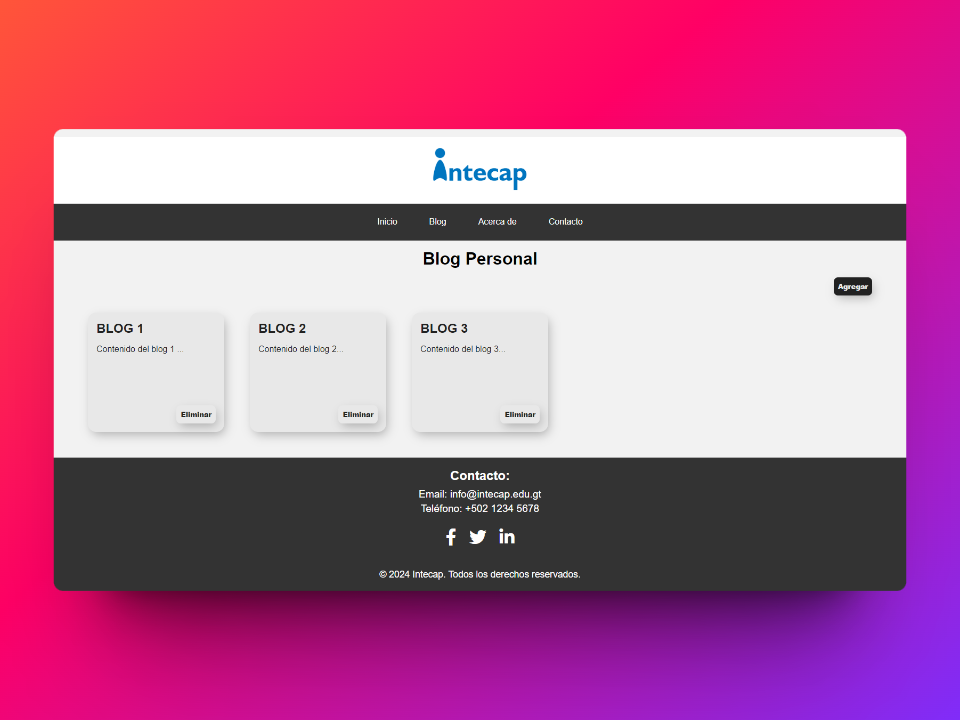
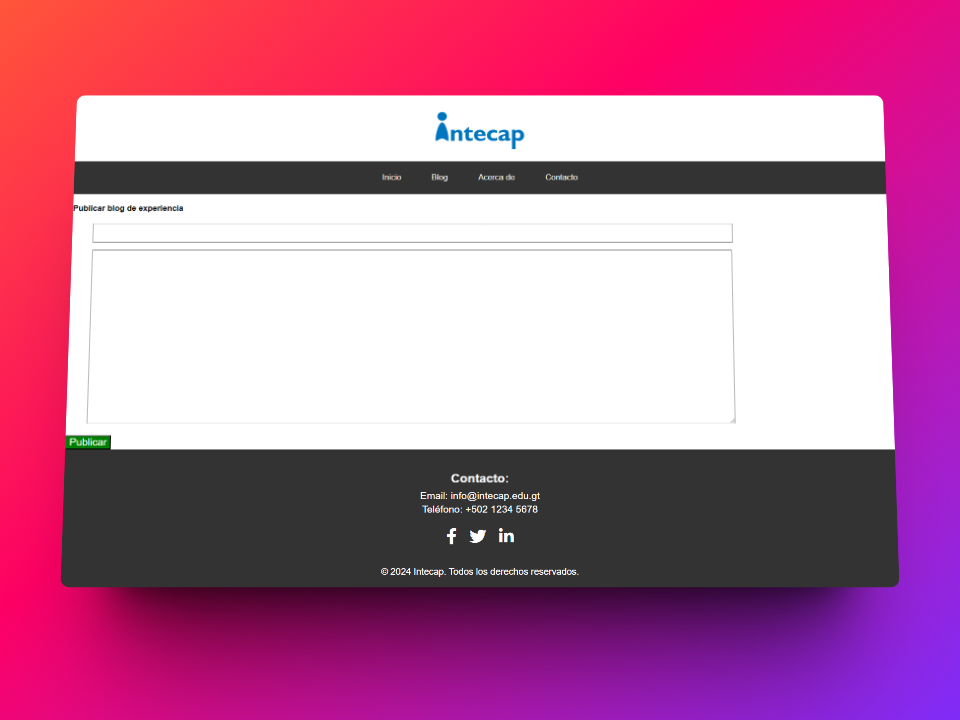
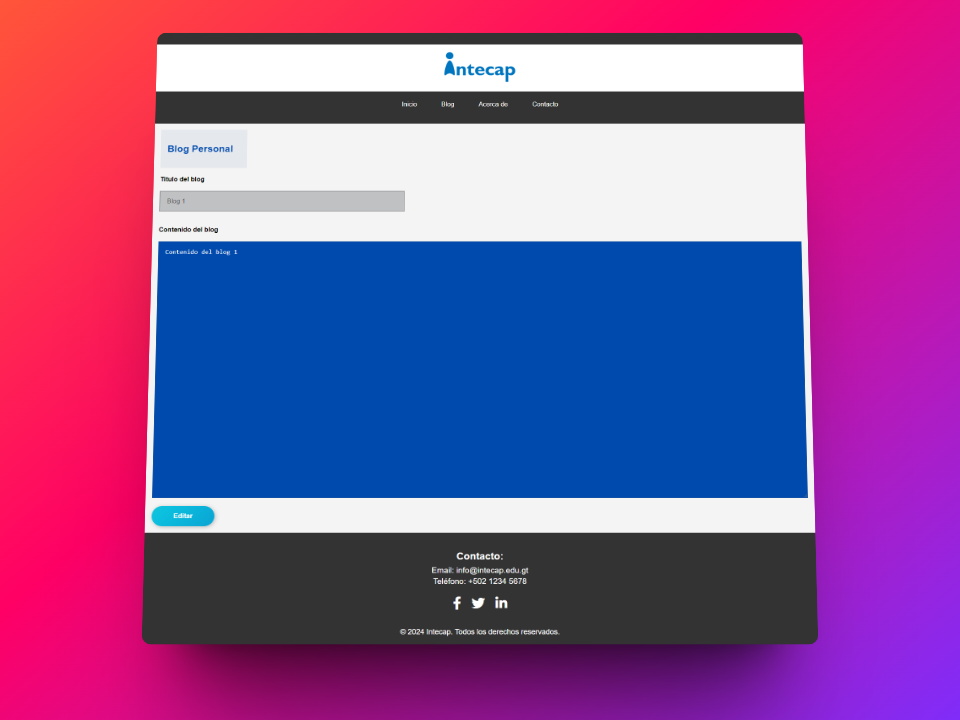
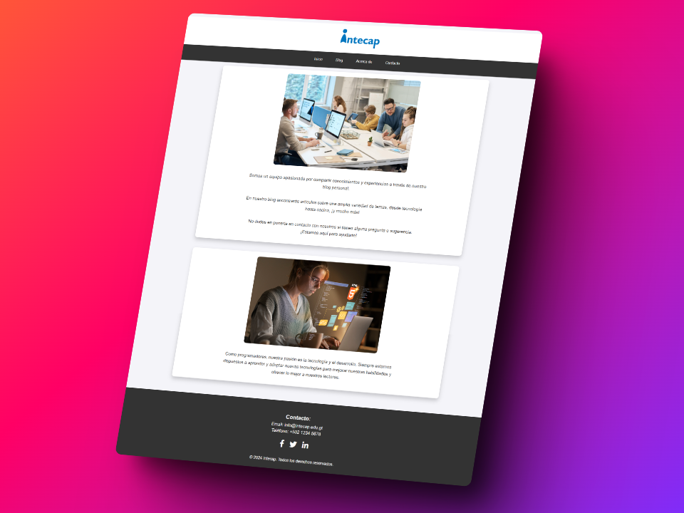
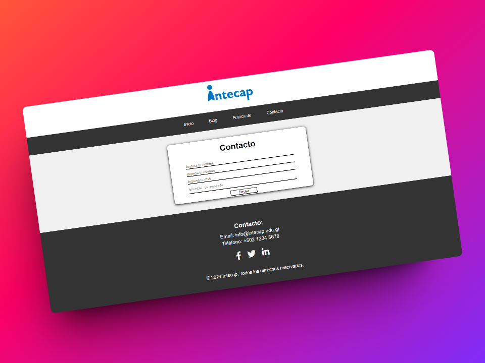

# 📷 Capturas de Pantallas







# Blog Personal

Práctica realizada como parte del curso de Desarrollador FullStack por INTECAP, como parte de una beca otorgada. La práctica consiste en el desarrollo de una página web de un Blog Personal.

## Integrantes y Roles

|                                    Nombre                                                |                                                                                 Redes                                                                                  | Rol Principal |
| :--------------------------------------------------------------------------------------------------: | :--------------------------------------------------------------------------------------------------------------------------------------------------------------------: | :-----------: |
|    <br /> **Andre Bran**    | [](https://github.com/Abranr)</a> <br />  | **FrontEnd**  |
|  <br /> **Danilo Calderón** |   [](https://github.com/Danilo0203)</a> <br />    | **FrontEnd**  |
|    <br /> **Luis Díaz**    | [](https://github.com/rodrigogt97)</a> <br /> | **FrontEnd**  |
|   <br /> **Ilmer Aldana**  |    [](https://github.com/Iomar99)</a> <br />     | **FrontEnd**  |
|  <br /> **Aydily Álvarez**  |     [](https://github.com/Aydily)</a> <br />     | **FrontEnd**  |

## 🛠️ Tecnologías Utilizadas

|  |  |  |
| :----------------------------------------------------------------------------------------------------: | :------------------------------------------------------------------------------------------------: | :----------------------------------------------------------------------------------------------------------------: |

## ℹ️ Instrucciones de Uso

1. **Clonar el Repositorio**: Copia este repositorio en tu máquina local ejecutando el siguiente comando en tu terminal:

   ```bash
   https://github.com/Abranr/blog-personal.git
   ```

2. **Abrir la Página**: Una vez que hayas clonado el repositorio, abre el archivo HTML principal en tu navegador web para visualizar la página.

## 🤝 Contribución

¡Las contribuciones son bienvenidas! Si deseas mejorar este proyecto, siéntete libre de abrir un _pull request_ y contribuir con tus ideas.


